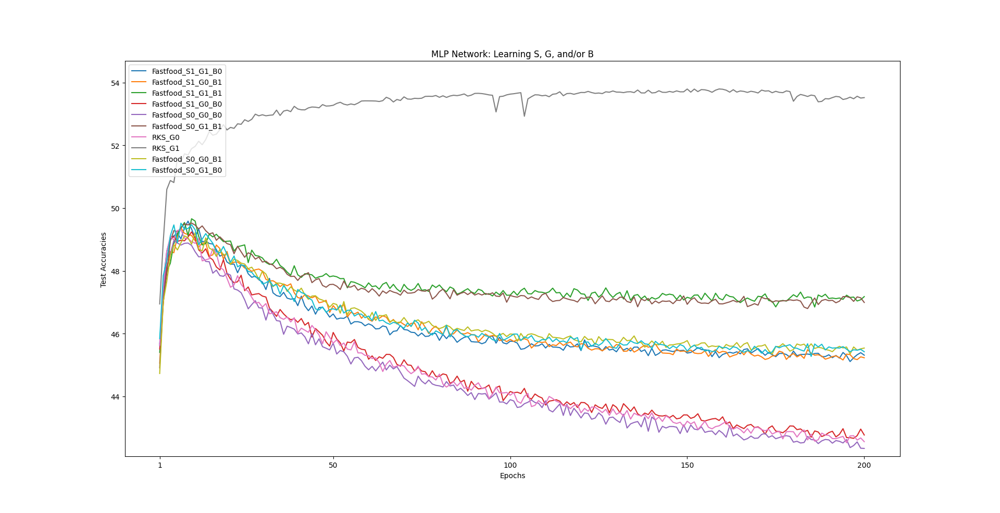
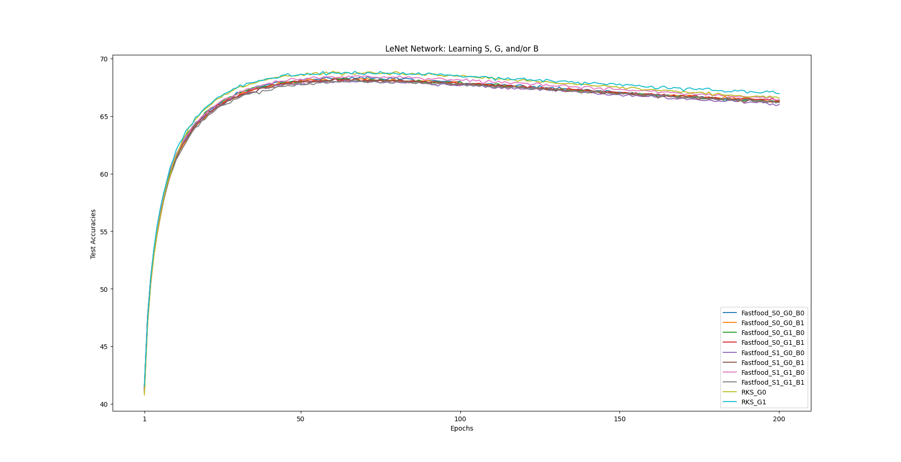
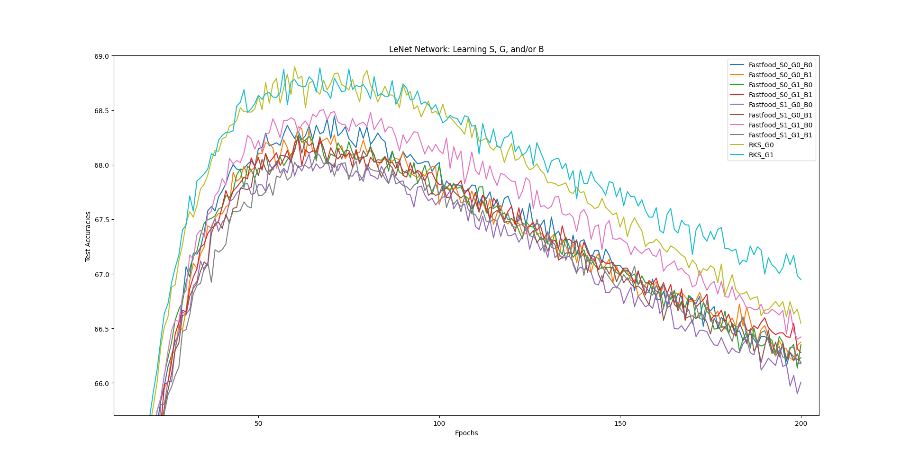
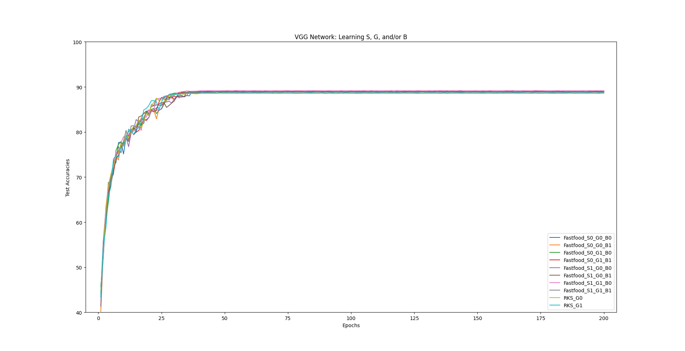
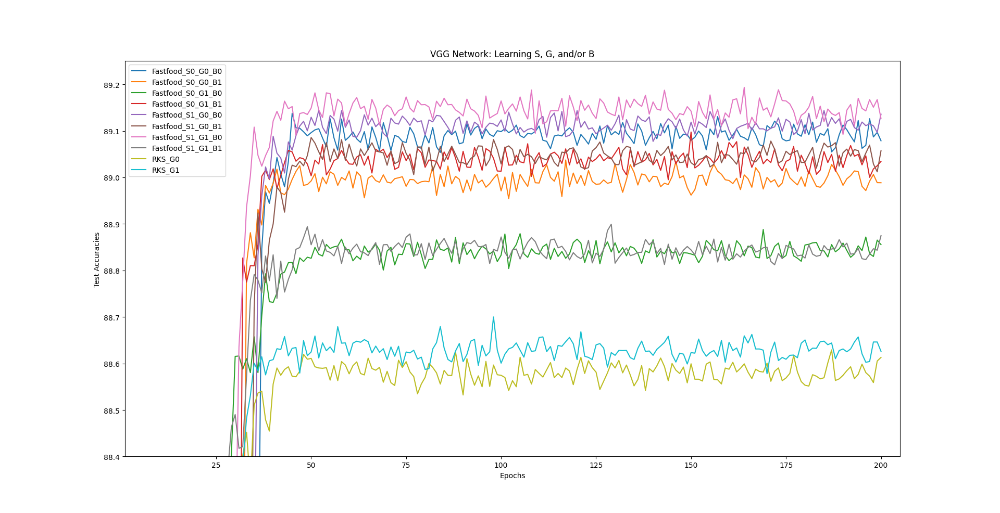

<h1>
  Torched and Fried
</h1>

Torched and Fried is a software package that implements kernel approximation algorithms [Fastfood (Le, Sarlos, Smola, 2013)](https://arxiv.org/abs/1408.3060) and [Random Kitchen Sink (Rahimi, Recht, 2007)](https://dl.acm.org/doi/10.5555/2981562.2981710) into custom PyTorch layers. This allows for greater storage and computational efficiency in networks by reducing parameter counts with random feature layers, similarly to [Deep Fried Convnets (Yang, Moczulski, Demil, et al., 2014)](https://arxiv.org/abs/1412.7149). This package is distributed under the MIT License.

In order to gauge the efficiency and performance, we integrated the custom layers into different network architectures with various hyperparameters, and tested it against image classification datasets, namely Fashion MNIST and CIFAR-10.

<h2>Features</h2>

- **Transforms**: Custom PyTorch layers integrating Fastfood and RKS algorithms.
- **Networks**: Includes LeNet, MLP, and VGG network architectures that utilize the custom PyTorch layers to test on Fashion MNIST and CIFAR-10 datasets.
- **Performance Benchmarking**: Tools to compare the speed, accuracy, hyperparameter count, etc. of the networks, transforms, and low-level operations within the transforms.

<h2>Requirements</h2>

- **PyTorch** (tested with 2.5.1) 
- **SciPy** (tested with 1.14.1)
- **torchvision** (tested with 0.20.1)

**torchvision** is primarily used for the VGG model, along with files in the `tests` directory.

The following packages are needed for the files in the `tests` directory:
- **scikit-learn** (== 1.5.2)
- **scikit-learn-extra** (== 0.3.0)
- **matplotlib**
- **seaborn**

<h2>Installation</h2>

Navigate to the directory containing the project's `setup.py` file and run:
```
pip install .
```
This will install PyTorch (and its dependencies), SciPy, and the Torched and Fried module (named torchfry). 

The Fastfood layer can use different implementations of the Hadamard matrix transformation, each with different speeds. The test results included in this document utilize an implementation of the Fast Hadamard Transform (Dao, [2022](https://github.com/Dao-AILab/fast-hadamard-transform)), written in CUDA to leverage GPU parallelization with a PyTorch interface for easy use.

<h2>Usage</h2>

```
from torchfry.networks import LeNet, MLP, VGG
from torchfry.transforms import FastfoodLayer, RKSLayer
```

<h2>Performance</h2>
The following figures all depict neural network performance in image classification tasks with the CIFAR-10 dataset.

<h3>Multi-layer Perceptron</h3>

The following plot shows the test accuracy performance of a multi-layer perceptron (MLP) that uses FastfoodLayer or RKSLayer in place of standard fully-connected linear layers for the hidden layers. The optimizer used for this network is Adam, so learning rate was set to 0.1%.

All learning/nonlearning hyperparameter combinations, besides a learnable Gaussian matrix for RKSLayer, peak early in accuracy, but quickly worsen in various magnitudes starting from 49% accuracy. It seems that learning the diagonal Gaussian and binary scaling matrix for FastfoodLayer (green and brown lines) aids in mitigating this drop in performance, while learning the scaling matrix provides negligible results.

 

<h3>LeNet</h3>

The following shows the performance of a LeNet architecture (series of convolutional layers, followed by linear/random feature layers) that replaces the linear fully-connected layer right before the output layer with one of our random feature layers.

This architecture overall does signficantly better than the MLP, achieving accuracy scores about 20 greater. 


Upon closer look, RKSLayer provides around 2%+ better accuracy compared to FastfoodLayer. It also seems that learning all three random matrices for Fastfood leads to a slight hit in performance.


<h3>VGG</h3>

Lastly, the VGG network architecture shows impressive results, reaching up to 89.2% accuracy which is a large improvement over the other networks. All of the learnable hyperparameter combinations for FastfoodLayer lead to greater accuracies compared to RKSLayer (though only by about 0.6%), so VGG-based architectures seem to do well with the random feature layers in general.



---

This project includes modified and unmodified code from [**structured-nets**](https://github.com/HazyResearch/structured-nets) (originally licensed under the Apache License 2.0) and [**OnLearningTheKernel**](https://github.com/cs1160701/OnLearningTheKernel) (no original license).

See NOTICE for details. 