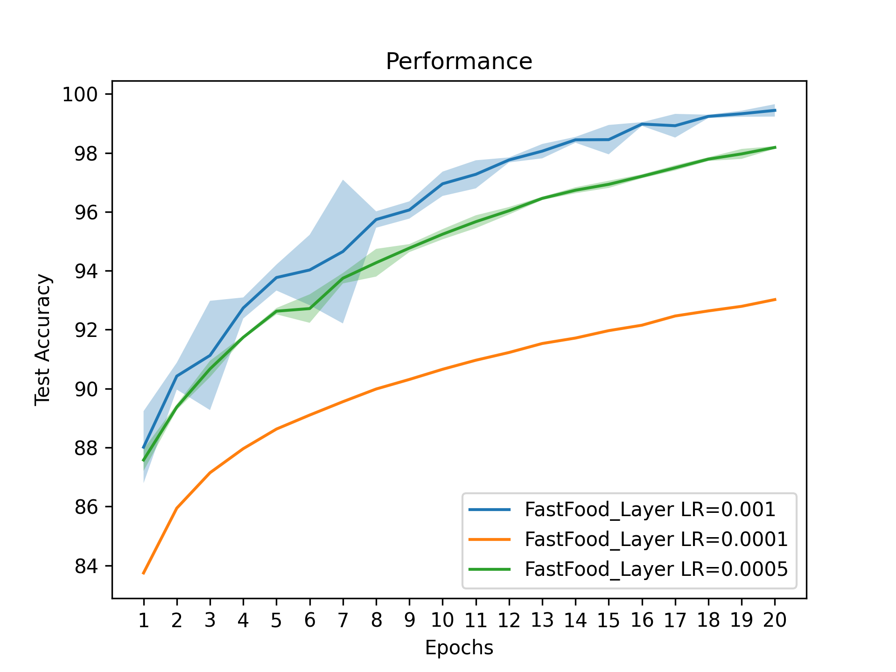
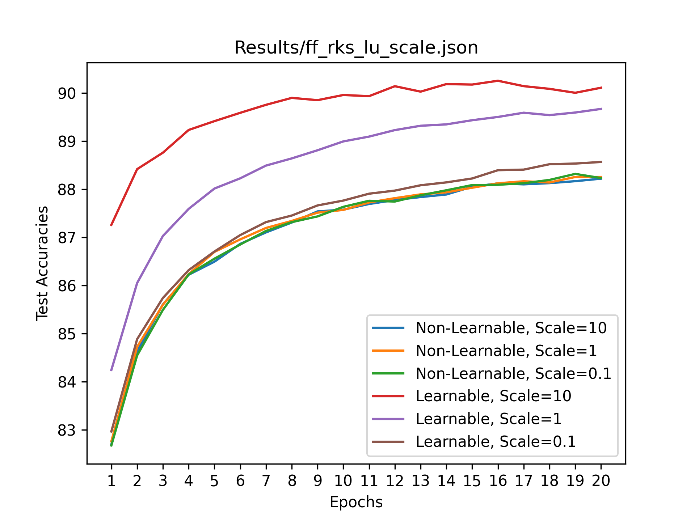

<h1>
  Fastfood Torch
</h1>

Fastfood Torch is a software package that implements the Fastfood algorithm (Le, Sarlos, Smola, [2013](https://arxiv.org/abs/1408.3060)) and Random Kitchen Sink algorithm (Rahimi, Recht, [2007](https://dl.acm.org/doi/10.5555/2981562.2981710)) as custom PyTorch layers for use in different networks for more efficient kernel approximation. It is distributed under MIT License.

The performance of these layers are tested against each other in different networks with various hyperparameters, primarily on MNIST, Fashion MNIST, and CIFAR-10 datasets.

<h2>Features</h2>

- **Transforms**: Custom PyTorch layers integrating Fastfood and RKS algorithms.
- **Networks**: Includes LeNet, MLP, and VGG network architectures that utilize the custom PyTorch layers to test on MNIST, Fashion MNIST, and CIFAR-10 datasets respectively.
- **Performance Benchmarking**: Tools to compare the speed, accuracy, hyperparameter count, etc. of the networks, transforms, and low-level operations within the transforms.

<h2>Requirements</h2>

- **PyTorch** (tested with 2.5.1) 
- **SciPy** (tested with 1.14.1)

The following packages are needed for the files in the `tests` directory:
- **numpy** (tested with 1.26.4) 
- **scikit-learn** (== 1.5.2)
- **scikit-learn-extra** (== 0.3.0)
- **torchvision** (tested with 0.20.1)
- **matplotlib**
- **seaborn**

<h2>Installation</h2>

Navigate to the directory containing the project's `setup.py` file and run:
```
pip install .
```
This will install PyTorch (and its dependencies), SciPy, and the Fastfood Torch module. 

The Fastfood layer can use different implementations of the Hadamard matrix transformation, each with different speeds. The test results included in this document utilize the Fast Hadamard Transform implementation (Dao, [2022](https://github.com/Dao-AILab/fast-hadamard-transform)).

<h2>Usage</h2>

```
from fastfood_torch.networks import LeNet, MLP, VGG
from fastfood_torch.transforms import FastFoodLayer, RKSLayer
```

<h2>Speed</h2>

TODO: Compile more results with consistent and good labeling, create tables showing results across different networks, and brief discussion of results.



---



---

This project includes modified and unmodified code from **structured-nets** ([originally licensed under the Apache License 2.0](https://github.com/HazyResearch/structured-nets)) and **OnLearningTheKernel** ([no original license](https://github.com/cs1160701/OnLearningTheKernel)).

See THIRD_PARTY_LICENSES for details.